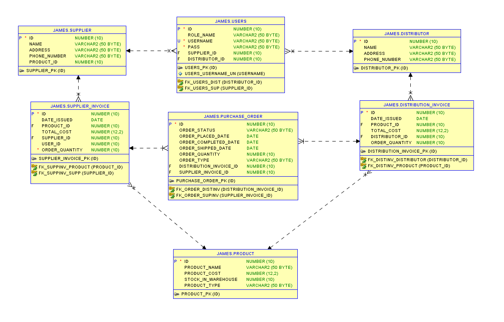

# Project2SupplyChainManagement

## Project Description
This supply chaing management system is to help sreamline the process keeping reccords for the company Cereal for Coders. This system will store all transactions and keep record of what their current invintory is. It will also allow for the client to review Buisness Information made through Google Data Studio to help make future decisions. 

## Technologies Used
* Java
* Spring Data
* Spring Web
* Oracle DB
* HTML
* JavaScript
* CSS
* JUnit 5
* Cucumber

## Features
* The company will be able to track the inbound and outbound logistics.
* Maintain knowledge of current warehouse stock of products.
* System automation of making orders of raw goods when needed to fulfill outbound orders.
* Automatic creation of order invoice.
* Buisness intelegence of past orders: https://datastudio.google.com/u/0/reporting/9d9cd800-90e5-4bc0-bca0-258abf53400d/page/yD62B

To-do list:
* add ablility for admin to add new products to the warehouse
* allow for less automation in the order shipping process to allow admins to update those fields when necissary

## Getting Started
git colne https://github.com/nickrens/Project2SupplyChainManagement.git

Create a database based on this ERD

update the application.properties file to match your DB's URL, username, and password.

Create users and distributors as needed.

Run as Spring Application. 

## Contributors
* Nicholas Rens
* Jeff Strunk
* James Patten
* Lakshmi Satish
